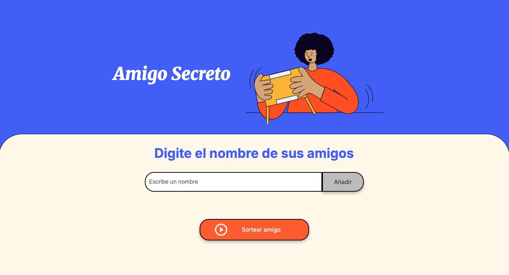
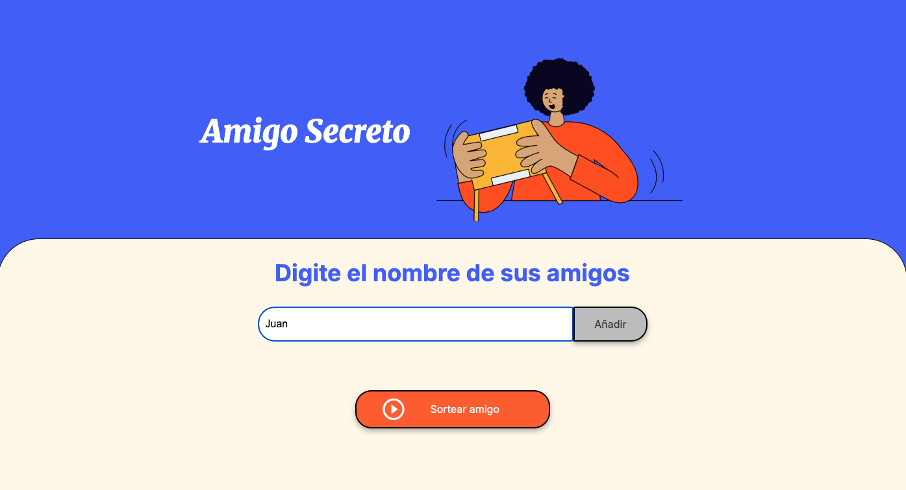
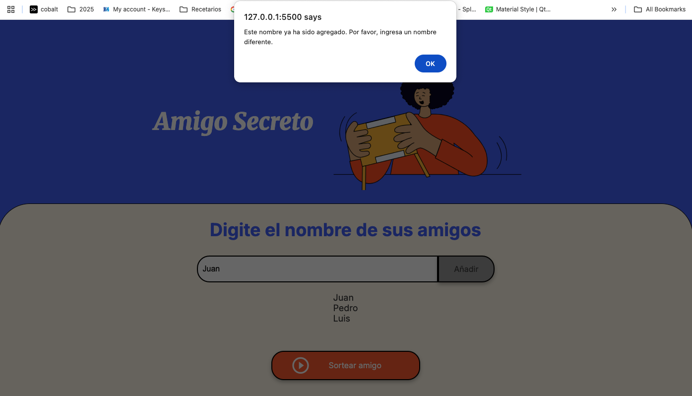
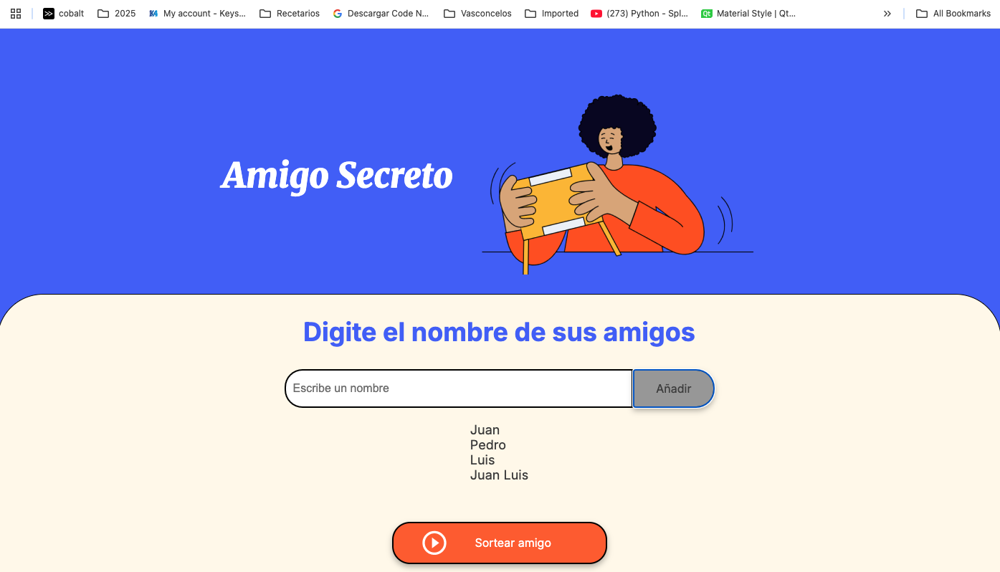
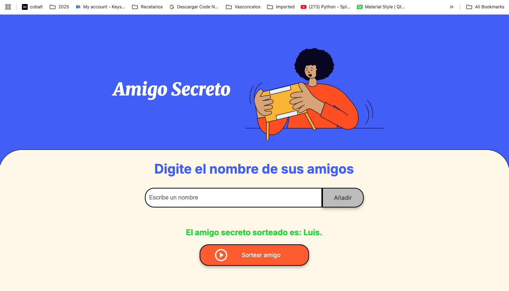

# Challenge - Amigo secreto


<p align="center">
  
  
  
  
</p>

## 📑 Índice
- [Introducción](#-introducción)
- [Objetivo](#-objetivo)
- [Descripción](#-descripción)
- [Características](#-características)
- [Instalación y uso](#-instalación-y-uso)
- [Preview](#-preview)
- [Licencia](#-licencia)

## 📌 Introducción  
Esta aplicación web fue desarrollada como parte de un *challenge* del programa **ONE - Alura Latam**.  
El objetivo de este reto fue poner en práctica los conocimientos adquiridos en la formación de **Principiante en Programación**, 
aplicando **HTML** y **JavaScript** para resolver un problema real: organizar un sorteo de "Amigo Secreto" de forma sencilla y rápida.  

## 🎯 Objetivo  
Facilitar la organización de sorteos de Amigo Secreto mediante una herramienta web interactiva que permita registrar participantes, 
generar asignaciones aleatorias y mostrarlas en pantalla, evitando la necesidad de hacerlo manualmente.  

## 📝 Descripción  
La aplicación permite al usuario agregar los nombres de los participantes y, con un solo clic, realizar el sorteo para asignarle a una persona su “amigo secreto”.  
El resultado se presenta en pantalla de forma clara e inmediata.  
Fue desarrollada utilizando tecnologías web básicas para asegurar su fácil ejecución en cualquier navegador sin necesidad de configuraciones adicionales.  

## ✨ Características  
- **Interfaz sencilla e intuitiva**: pensada para ser fácil de usar incluso para personas con poca experiencia tecnológica.  
- **Sorteo aleatorio**: el algoritmo asegura que cada participante reciba un amigo secreto diferente a sí mismo.  
- **Validación de entradas**: evita nombres vacíos o duplicados para garantizar la integridad del sorteo.  
- **Ejecución 100% en el navegador**: no requiere instalación ni conexión a una base de datos.  
- **Diseño adaptable**: interfaz compatible con dispositivos móviles y de escritorio.  
- **Código organizado y comentado**: facilita la lectura y el mantenimiento.

## 🚀 Instalación y uso  
1. **Clonar el repositorio**
   ```bash
   git clone https://github.com/gmarcialj/challenge-amigo-secreto.git

2. **Abrir el proyecto**
  * Entra en la carpeta del repositorio.
  * Abre el archivo ```index.html``` en tu navegador.
  * *(No requiere instalación de dependencias, todo funciona directamente en el navegador).*

3. **Usar la aplicación**
  * Escribe los nombres de todos los participantes en el campo de texto y pulsa el botón **"Agregar"**.
  * Cuando los nombres estén cargados, haz clic en el botón **"Sortear amigo"**.
  * El resultado de tu "amigo secreto" se mostrará inmediatamente en pantalla.
  * Una vez realizado el sorteo, no es posible generar otro a menos que se refresque la página.

## 👀 Preview
### Pantalla principal


### Escribiendo el nombre de los participantes


### Si el nombre ya está duplicado, se mostrará una alerta


### La lista de participantes se va actualizando al dar clic en el botón "Añadir"


### Al dar clic en sortear amigo, se mostrará el "Amigo secreto" asignado


## 📄 Licencia
Este proyecto no cuenta con ninguna licencia, cualquiera puede usarlo, descargarlo y modificarlo a su gusto.

